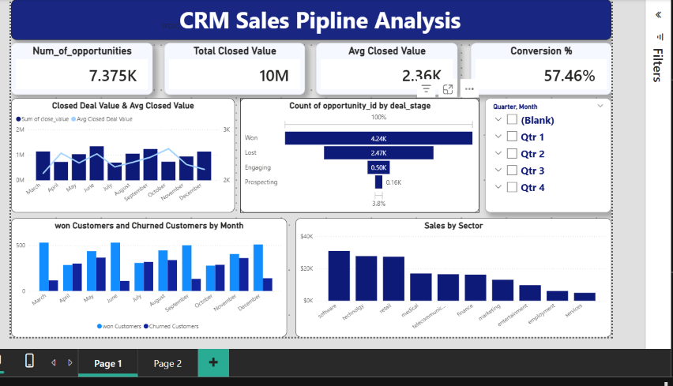
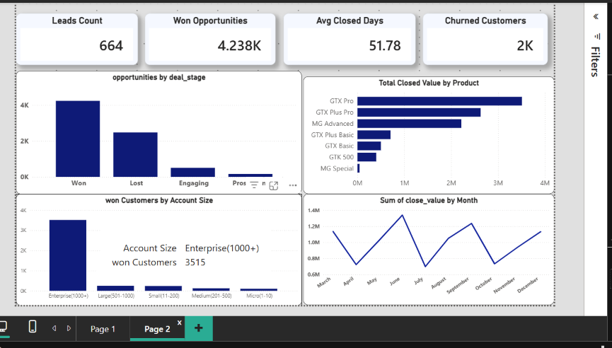

# CRM Sales Pipeline Analysis — Power BI Dashboard

An interactive Power BI dashboard analyzing sales pipeline performance, customer segmentation, churn behavior, and product/sector revenue contribution — built to support data-driven sales decision-making.

## 📊 Overview

This project explores a CRM sales dataset structured across four relational tables to uncover actionable insights into sales team performance, deal progression, and revenue drivers. The dashboard is designed to move beyond descriptive reporting and answer specific business questions that support operational decisions.

## 🖼️ Dashboard Preview

**Page 1 — Executive Overview**
KPI summary cards (Total Closed Value, Avg Closed Value, Conversion %), closed deal value trend, deal count by stage, won vs. churned customers by month, and sales by sector.

<!-- Replace the line above with your own image path, e.g. ./your-image-name.png -->

**Page 2 — Deal Stage & Account Analysis**
Opportunity distribution by deal stage, won customers by account size, and monthly sales trend.

<!-- Replace the line above with your own image path, e.g. ./your-image-name.png -->

## 🗂️ Data Model

The dashboard is built on a relational schema with the following tables:

| Table | Key Columns |
|---|---|
| `sales_pipeline` | opportunity_id, sales_agent, product, account, deal_stage, engage_date, close_date, close_value |
| `sales_team` | sales_agent, manager, regional_office |
| `products` | product, series, sales_price |
| `accounts` | account, sector, year_established, revenue, employees, office_location, subsidiary_of |

## ❓ Business Questions Answered

- What is the overall deal distribution across pipeline stages (Won / Lost / Engaging / Prospecting)?
- What is the total closed revenue, average deal value, and average time to close?
- Are we losing as many customers (churn) as we are gaining (won) each month?
- How does monthly sales performance trend over time?
- Which account size segment (Enterprise, Large, Medium, Small, Micro) drives the most revenue?
- Which sectors generate the highest revenue, and which underperform?
- What is the overall conversion rate from opportunity to closed deal?
- Which products contribute the most to total closed revenue?

## 💡 Key Insights

- **Churn vs. Acquisition:** Monthly won and churned customer counts were tracked side by side, revealing periods where customer growth was largely offset by churn — shifting the analytical focus toward retention rather than acquisition alone.
- **Account Size Concentration:** Revenue from closed deals was found to be concentrated in specific account-size segments, highlighting an opportunity to realign sales team focus toward the highest-value customer tiers.
- **Pipeline Bottlenecks:** Visualizing opportunities by deal stage exposed where deals were stalling before closing, pointing to specific process improvements to shorten the sales cycle.
- **Product & Sector Performance:** Revenue was broken down by product and sector to identify top performers and underperforming areas warranting further investigation.

## 🔍 Data Quality Challenges & Solutions

During analysis, two notable data interpretation and quality issues were identified and resolved:

1. **Zero / Blank `close_value` handling:** Rather than treating these as errors, they were correctly interpreted based on business logic — a `close_value` of zero corresponds to a deal in the "Won" stage with no revenue impact, while a blank value indicates a deal still in the "Prospecting" or "Engaging" stage (not yet closed). This distinction was preserved to avoid misrepresenting pipeline data.
2. **"(Blank)" category in product-level aggregation:** Investigated an unexpected "(Blank)" grouping in product-level revenue charts. Root-caused it to unmatched relationship keys between the `sales_pipeline` and `products` tables (inconsistent formatting/casing), and resolved it through data cleaning in Power Query — improving the accuracy and reliability of product-level reporting.

## 🛠️ Tools Used

- **Power BI Desktop** — data modeling, DAX measures, and interactive visualizations
- **Power Query** — data cleaning and transformation

## 📁 Repository Contents

- `CRM_Sales_Pipeline_Analysis.pbix` — Power BI project file
- Dashboard preview images (placed next to this README — update the image filenames above to match yours)
- `README.md` — Project documentation

## 👤 Author

**Rehab Mahmoud**
Data Analyst | BI & Python Data Analysis

---
*This project was built as part of ongoing work in business intelligence and data analytics, focusing on translating raw CRM data into actionable business insights.*